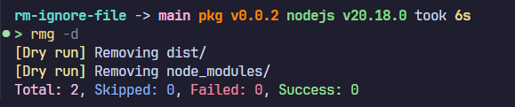
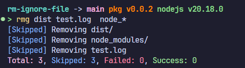

# rm-ignore-file [](https://npmjs.com/package/rm-ignore-file)

Find the files or folders declared in. gitignore and delete them

## Install

```bash
npm i rm-ignore-file
```

### Usage

- Remove all files and folders in .gitignore

```bash
rmg
```


- Dry run

```bash
rmg -d
```



- Skip certain folders or files

```bash
rmg dist node_* *.log
```



## License

[MIT](./LICENSE) License © 2024 [duowb](https://github.com/duowb)
